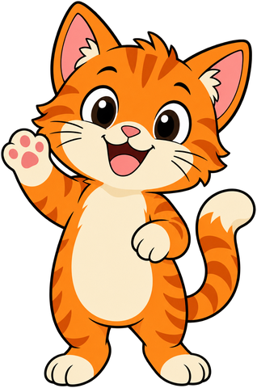
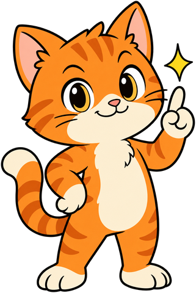
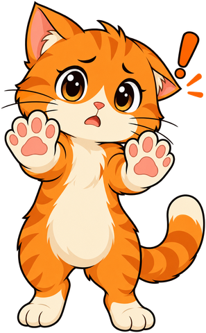
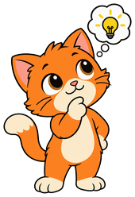
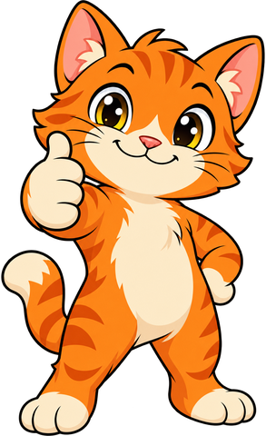

# Advanced Control and Operators

## Summary

Explores complex loops, Boolean logic, clone management, and physical computing extensions. This chapter covers 25 concepts from the learning graph, building on prerequisite concepts from earlier chapters.

## Concepts Covered

This chapter covers the following 25 concepts from the learning graph:

1. Reusability
2. Run Without Screen Refresh
3. Drawing Trails
4. Rainbow Lines
5. Camera Games
6. Credit Attribution
7. Remix Tree
8. Pseudocode
9. Stamp
10. Unpredictable Gameplay
11. Error Detection
12. Infinite Loop Detection
13. Lip Sync Animation
14. Scene Coordination
15. Dialogue Timing
16. Delete This Clone
17. Clone Behavior
18. Event Queue
19. Condition Controlled Loop
20. And Operator
21. Or Operator
22. Not Operator
23. Score Variable
24. Lives Variable
25. Timer Variable

## Prerequisites

This chapter builds on concepts from:

- [1. Welcome to Scratch](../01-welcome-to-scratch/index.md)
- [2. Sprites, Stage, and the Coordinate System](../02-sprites-stage-coordinates/index.md)
- [4. Events, Sequences, and First Scripts](../04-events-sequences-first-scripts/index.md)
- [5. Sounds, Extensions, and Sharing Projects](../05-sounds-extensions-sharing/index.md)
- [6. Broadcasting, Conditionals, and Sensing](../06-broadcasting-conditionals-sensing/index.md)
- [7. Variables, Lists, and Data Management](../07-variables-lists-data/index.md)
- [8. Animation, Parallelism, and Debugging](../08-animation-parallelism-debugging/index.md)

---

!!! mascot-welcome "Loops, Logic, and Clones Galore"
    { class="mascot-admonition-img" }
    Get ready to level up your Scratch superpowers! In this chapter you'll build reusable custom blocks, spin up clones for particles and enemies, paint with the pen tool, and combine booleans with and/or/not to make truly smart decisions. By the end you'll have the exact toolkit real game designers use for randomness, timers, and clean bug-free loops. Let's build something purr-fect!

## Reusability — Write Once, Use Everywhere!

### What Is Reusability?

**Reusability** = writing code **once** and using it **many times** in different places or projects!

### The Reusability Ladder

| Level | What It Looks Like | Benefit |
|-------|-------------------|---------|
| **Copy-paste** | Duplicate blocks everywhere | Fast but hard to fix |
| **Custom blocks** | `define jump` used 10 times | Fix once, updates everywhere |
| **Backpack** | Save to 🎒, use in any project | Universal tools |
| **Extensions** | Share with community | Help others too! |

---

### Making Code Reusable

#### 1. Custom Blocks (Best for Same Project)

<div class="scratch">
define jump (height)
change y by (height)
wait (0.2) seconds
change y by ((height) * (-1))
</div>

**Use anywhere:** `jump (100)`, `jump (20)`, `jump (50)`

#### 2. Backpack (Best for Across Projects)

1. Build perfect script
2. Drag to 🎒 Backpack
3. Open new project → drag from Backpack

#### 3. Remix + Modify

1. Find project with cool feature
2. Remix it
3. Extract just what you need
4. Save to Backpack

---

### Reusability Checklist

| ✅ Reusable Code... | ❌ Not Reusable... |
|---------------------|-------------------|
| Has parameters (inputs) | Hardcoded values everywhere |
| Does ONE thing well | Does 5 things at once |
| Clear name: `draw-polygon` | Vague name: `script1` |
| Works standalone | Depends on specific sprites |
| Commented! | Mystery code |

---

## Run Without Screen Refresh — Turbo Mode! ⚡

### What Is "Run Without Screen Refresh"?

**Turbo mode** for custom blocks — runs **instantly in one frame** instead of animating step-by-step!

### How to Enable

1. **Make a Block** in My Blocks (🩷 Pink)
2. Click **Options** (gear icon)
3. Check **"Run without screen refresh"**
4. Click OK

---

### When to Use Turbo Mode ✅

| Use Case | Why Turbo |
|----------|-----------|
| **Math calculations** | Instant result, no animation needed |
| **Setup/initialization** | Instant ready state |
| **Level generation** | Build entire level in one frame |
| **Data processing** | Sort lists, filter arrays |
| **Complex math** | Physics calculations, pathfinding |

---

### When NOT to Use Turbo ❌

| Use Case | Why Not Turbo |
|----------|---------------|
| **Animations** | Player WON'T see movement! |
| **Visual effects** | Particles, trails need time |
| **Player feedback** | Jump, hit effects need to be seen |
| **Step-by-step tutorials** | Player needs to see each step |

---

!!! mascot-tip "When in Doubt, Leave Turbo Off"
    { class="mascot-admonition-img" }
    A quick test: if a human needs to *see* it happen step by step (a jump, a hit effect, a walk cycle), Turbo mode will break it. Save "Run without screen refresh" for instant math, list building, and setup code where nobody needs to watch it happen.

### Turbo Mode Example

<div class="scratch">
define generate-level (width) (height) // Turbo ON!
// Generates entire 100x100 platformer level in 1 frame
repeat (width)
repeat (height)
if &lt;(pick random (1) to (10)) &lt; (3)&gt; then
add [platform] to [level-data v]
else
add [empty] to [level-data v]
end
end
end
</div>

**Generates 10,000 tiles in ONE frame!** ⚡

---

### Turbo + Backpack = Universal Tools!

<div class="scratch">
define quick-sort (list) // Turbo ON!
// Sort any list instantly
</div>

**Save to Backpack → use in ANY project for instant sorting!**

---

## Drawing Trails — Pen Magic! 🎨

<div class="scratch">
pen down
</div>

### Pen Extension Recap

**Extensions → Pen → Add** → green **Pen** category!

### Pen Drawing Blocks

<div class="grid" markdown>

<div class="card" markdown>
<div class="scratch">
pen down
</div>

Start drawing.
</div>

<div class="card" markdown>
<div class="scratch">
pen up
</div>

Stop drawing.
</div>

<div class="card" markdown>
<div class="scratch">
erase all
</div>

Clear everything.
</div>

<div class="card" markdown>
<div class="scratch">
stamp
</div>

Leave a costume copy as a drawing.
</div>

<div class="card" markdown>
<div class="scratch">
set pen color to [#0000ff]
</div>

Set an exact color.
</div>

<div class="card" markdown>
<div class="scratch">
change pen color by (10)
</div>

Cycle colors.
</div>

<div class="card" markdown>
<div class="scratch">
set pen size to (5)
</div>

Line thickness.
</div>

</div>

---

### Drawing Trails = Move + Pen Down!

<div class="scratch">
pen down
repeat (360)
move (10) steps
turn right (1) degrees
end
pen up
</div>

**Every step leaves a trail!** Creates a circle.

---

### Trail Patterns

<div class="grid" markdown>

<div class="card" markdown>
<div class="scratch">
repeat (360)
move (1) steps
turn right (1) degrees
end
</div>

Perfect circle.
</div>

<div class="card" markdown>
<div class="scratch">
repeat (360)
move (2) steps
turn right (1) degrees
change pen color by (1)
end
</div>

Colorful spiral.
</div>

<div class="card" markdown>
<div class="scratch">
repeat (sides)
move (size) steps
turn right ((360) / (sides)) degrees
end
</div>

Any polygon — set `sides` and `size` as variables.
</div>

<div class="card" markdown>
<div class="scratch">
repeat (5)
move (100) steps
turn right (144) degrees
end
</div>

5-pointed star.
</div>

<div class="card" markdown>
<div class="scratch">
repeat (36)
move (100) steps
turn right (170) degrees
end
</div>

Flower pattern.
</div>

</div>

---

### Trail Effects

<div class="grid" markdown>

<div class="card" markdown>
<div class="scratch">
change pen color by (1)
</div>

Shift color every step for a rainbow trail.
</div>

<div class="card" markdown>
<div class="scratch">
change pen size by (-0.1)
</div>

Shrink the line every step for a fading trail.
</div>

<div class="card" markdown>
<div class="scratch">
pen down
move (5) steps
pen up
move (5) steps
</div>

Alternate pen down/up for a dotted line.
</div>

<div class="card" markdown>
<div class="scratch">
change pen size by (-0.1)
</div>

Shrink the line from thick to thin.
</div>

</div>

---

## Rainbow Lines — Colorful Drawing! 🌈

### Change Pen Color by (10)

<div class="scratch">
change pen color by (10)
</div>

**Cycles through color spectrum** (0-200) — creates rainbow!

---

### Rainbow Pen Pattern

<div class="scratch">
when green flag clicked
erase all
pen down
set pen size to (5)
repeat (720)
move (5) steps
turn right (1) degrees
change pen color by (1)
end
pen up
</div>

**Draws a beautiful rainbow spiral!** 🌈

---

### Rainbow Variations

<div class="grid" markdown>

<div class="card" markdown>
<div class="scratch">
set pen size to (10)
</div>

Thicker rainbow line.
</div>

<div class="card" markdown>
<div class="scratch">
set pen size to (1)
</div>

Thin, delicate rainbow line.
</div>

<div class="card" markdown>
Two spirals drawn in opposite directions.
</div>

<div class="card" markdown>
<div class="scratch">
repeat (5)
move (100) steps
turn right (144) degrees
change pen color by (40)
end
</div>

Rainbow-colored star.
</div>

<div class="card" markdown>
<div class="scratch">
repeat (36)
move (100) steps
turn right (170) degrees
change pen color by (10)
end
</div>

Rainbow-colored flower.
</div>

</div>

---

### Rainbow + Stamp = Magic! ✨

<div class="scratch">
repeat (60)
move (50) steps
stamp
turn right (6) degrees
change pen color by (3)
change pen size by (-0.1)
end
</div>

**Stamps leave rainbow copies of sprite!** 🌈✨

---

## Camera Games — Body as Controller! 📷

<div class="scratch">
when video motion &gt; (50)
</div>

### Video Sensing Extension

**Extensions → Video Sensing → Add** → purple **Video Sensing** category!

### Video Sensing Blocks Recap

<div class="grid" markdown>

<div class="card" markdown>
<div class="scratch">
turn video [on v]
</div>

Start or stop the camera.
</div>

<div class="card" markdown>
<div class="scratch">
set video transparency to (50)
</div>

Set how see-through the video is.
</div>

<div class="card" markdown>
<div class="scratch">
video [motion v] on [this sprite v]
</div>

Reporter: motion amount, 0-100.
</div>

<div class="card" markdown>
<div class="scratch">
when video motion &gt; (50)
</div>

Hat block: runs when motion crosses the threshold.
</div>

</div>

---

### Camera Game Ideas

| Game Type | How It Works |
|-----------|--------------|
| **Body Pong** | Paddle follows your hand |
| **Dance Game** | Copy poses on screen |
| **Virtual Mirror** | Sprite copies your moves |
| **Motion Dodge** | Lean left/right to dodge |
| **Conduct Music** | Wave arms = change tempo |
| **Pop Bubbles** | Pop bubbles with hands |

---

### Camera Game Examples

#### Simple Motion Mirror

<div class="scratch">
when green flag clicked
turn video [on v]
set video transparency to (50)
forever
if &lt;(video [motion v] on [this sprite v]) &gt; (30)&gt; then
change color effect by (10)
play sound [pop v]
end
end
</div>

**Wave at camera → sprite reacts!** 👋

---

#### Hand-Controlled Sprite

<div class="scratch">
when green flag clicked
turn video [on v]
forever
// Sprite follows motion
if &lt;(video [motion v] on [this sprite v]) &gt; (20)&gt; then
// Move toward motion center
// (Requires additional logic for position)
change color effect by (5)
end
end
</div>

---

#### Beat Detection (Advanced)

<div class="scratch">
when green flag clicked
turn video [on v]
forever
if &lt;(video [motion v] on [this sprite v]) &gt; (50)&gt; then
change color effect by (25)
play sound [drum v]
wait (0.2) seconds
clear graphic effects
end
end
</div>

**Dance to the beat!** 🎵🕺

---

## Credit Attribution — Give Credit! 🙏

### Why Credit Matters

**Remixing** = building on others' work. **Credit** = acknowledging their contribution!

### Scratch Auto-Credit

When you **Remix** a project, Scratch **automatically adds**:

> "Remixed from [Original Project] by [Creator]"

---

### Manual Credit (When Building from Scratch)

| Source | How to Credit |
|--------|---------------|
| **Code pattern** | "Jump physics from @CoderJane's tutorial" |
| **Art/Sprites** | "Character art by @PixelArtist on Scratch" |
| **Music/Sounds** | "Music: 'Adventure' by Kevin MacLeod (incompetech.com)" |
| **Sound Effects** | "Coin sound from freesound.org user @AudioMaker" |
| **Ideas/Mechanics** | "Enemy AI inspired by @GameDevPro's 'Enemy AI' project" |

---

### Credit in Project Page

```
## Credits
- **Programming**: Me
- **Art**: Me (except enemy sprites by @PixelArtist)
- **Music**: "Adventure" by Kevin MacLeod (CC BY 4.0)
- **Sounds**: Coin sound from freesound.org
- **Inspiration**: Enemy AI pattern from @GameDevPro's "Enemy AI"
- **Tutorials**: Jump physics from @CoderJane's "Platformer Physics"
```

---

### Credit in Code (Comments)

<div class="scratch">
define jump (height) // Jump physics adapted from @CoderJane's platformer tutorial
change y by (height)
wait (0.2) seconds
change y by ((height) * (-1))
</div>

---

### Credit Etiquette

| ✅ Do | ❌ Don't |
|-------|----------|
| Credit in project notes | Claim 100% original |
| Credit in code comments | Remove original credits when remixing |
| Link to original | Hide credits in hard-to-find places |
| Thank creators | Claim others' work as yours |

---

## Remix Tree — Your Project's Family Tree! 🌳

### What Is a Remix Tree?

**Remix Tree** = visual family tree showing **your project → its remixes → their remixes → etc.!**

### Viewing Remix Tree

1. Go to your **project page**
2. Click **Remix Tree** button (tree icon)
3. Explore the family!

---

### Remix Tree Features

| Feature | What It Shows |
|---------|---------------|
| **Direct remixes** | Projects directly remixed from yours |
| **Grand-remixes** | Remixes of remixes (2nd generation) |
| **Stats** | Views, loves, favorites for each branch |
| **Timeline** | When each remix was created |

---

### Why Remix Tree Matters

| Insight | Value |
|---------|-------|
| **Impact** | How far your idea spread |
| **Inspiration** | See how others extended your idea |
| **Community** | Connect with remixers |
| **Learning** | See different takes on your concept |

---

## Pseudocode — Plan Before Code! 📝

### What Is Pseudocode?

**Pseudocode** = writing your algorithm in **plain English** (or your language) **before** coding!

### Why Pseudocode?

| Benefit | Explanation |
|---------|-------------|
| **Think first** | Plan logic without syntax errors |
| **Share with team** | Non-coders can review |
| **Catch bugs early** | Logic errors caught before coding |
| **Language agnostic** | Works for any programming language |

---

### Pseudocode Examples

#### Player Jump (Pseudocode)

```
WHEN green flag clicked:
    SET velocity-y to 0
    FOREVER:
        IF space pressed AND onGround:
            SET velocity-y to JUMP_POWER
        END IF
        
        // Apply gravity
        CHANGE velocity-y by GRAVITY
        
        // Move player
        CHANGE y by velocity-y
        
        // Ground check
        IF touching ground:
            SET velocity-y to 0
            SET onGround to TRUE
        ELSE:
            SET onGround to FALSE
        END IF
    END FOREVER
```

#### Enemy Patrol (Pseudocode)

```
WHEN green flag clicked:
    FOREVER:
        MOVE forward 2 steps
        IF touching EDGE OR NOT touching ground:
            TURN 180 degrees
        END IF
        
        IF distance to PLAYER < 200:
            BROADCAST "chase-player"
        END IF
    END FOREVER
```

---

### Pseudocode → Scratch Blocks

| Pseudocode | Scratch Blocks |
|------------|----------------|
| `IF condition:` | `if <condition> then` |
| `ELSE:` | `else` |
| `END IF` | `end` |
| `FOREVER:` | `forever` |
| `REPEAT N times:` | `repeat (N)` |
| `SET var TO value:` | `set [var] to (value)` |
| `CHANGE var BY amount:` | `change [var] by (amount)` |
| `BROADCAST message:` | `broadcast [message]` |
| `WAIT seconds:` | `wait (secs) secs` |

---

### Pseudocode Template

```
PROJECT: [Game Name]
GOAL: [What player does]

MAIN LOOP (when green flag clicked):
    SETUP: initialize variables, positions
    FOREVER:
        INPUT: check keys, sensors
        UPDATE: physics, AI, movement
        CHECK: collisions, win/lose
        RENDER: costumes, effects, UI
    END FOREVER

FUNCTIONS (custom blocks):
- define jump (height): ...
- define spawn-enemy (type): ...
- define check-collision (sprite): ...
```

---

## Stamp — Leave Your Mark! 🖼️

### Stamp Block (Pen → Green)

<div class="scratch">
stamp
</div>

**Leaves a copy of current costume** as a permanent drawing on stage!

---

### Stamp vs Pen Down

| Feature | `stamp` | `pen down` |
|---------|---------|------------|
| **What it draws** | Current costume | Line trail |
| **Sprite orientation** | Matches sprite rotation | Follows movement path |
| **Size** | Matches sprite size | Pen size setting |
| **Color effects** | Includes ghost, color, etc. | Pen color only |

---

### Stamp Examples

#### Stamp Circle (Flower)

<div class="scratch">
when green flag clicked
erase all
pen up
repeat (12)
go to x: (0) y: (0)
move (100) steps
stamp
turn right (30) degrees
end
</div>

**12 stamps in a circle = flower!** 🌸

#### Stamp Trail (Particle Effect)

<div class="scratch">
when I start as a clone
go to x: (pick random (-200) to (200)) y: (180)
repeat (20)
stamp
change y by (-10)
change ghost effect by (5)
wait (0.05) seconds
end
delete this clone
</div>

**Falling particle trail!** ✨

---

### Stamp Patterns

<div class="grid" markdown>

<div class="card" markdown>
<div class="scratch">
repeat (12)
move (100) steps
stamp
turn right (30) degrees
end
</div>

12 stamps around a circle.
</div>

<div class="card" markdown>
<div class="scratch">
repeat (50)
move (10) steps
stamp
turn right (20) degrees
change size by (-2)
end
</div>

Shrinking spiral of stamps.
</div>

<div class="card" markdown>
<div class="scratch">
repeat (5)
repeat (5)
move (50) steps
stamp
end
turn right (90) degrees
move (50) steps
end
</div>

Rows and columns of stamps.
</div>

<div class="card" markdown>
<div class="scratch">
repeat (20)
stamp
turn right (18) degrees
change ghost effect by (5)
end
</div>

Fading ring of stamps, like an explosion.
</div>

</div>

---

## Unpredictable Gameplay — Randomness = Replayability! 🎲

### Why Unpredictability?

**Predictable games get boring. Randomness = infinite replayability!**

### Sources of Randomness

<div class="grid" markdown>

<div class="card" markdown>
<div class="scratch">
pick random (-200) to (200)
</div>

Spawn locations.
</div>

<div class="card" markdown>
<div class="scratch">
pick random (1) to (5)
</div>

Spawn intervals.
</div>

<div class="card" markdown>
<div class="scratch">
pick random (1) to (3)
</div>

Enemy variety.
</div>

<div class="card" markdown>
<div class="scratch">
pick random (1) to (100)
</div>

Loot tables.
</div>

<div class="card" markdown>
<div class="scratch">
pick random (-10) to (10)
</div>

Wandering AI.
</div>

</div>

---

### Controlled Randomness

**Pure randomness can feel unfair. Control it!**

<div class="grid" markdown>

<div class="card" markdown>
<div class="scratch">
if &lt;(pick random (1) to (100)) &lt; (20)&gt; then
say [Rare item!] for (1) seconds
else
say [Common item] for (1) seconds
end
</div>

About a 20% chance of the rare branch.
</div>

<div class="card" markdown>
<div class="scratch">
if &lt;(kills) = (10)&gt; then
say [Guaranteed rare drop!] for (1) seconds
end
</div>

Force a rare reward at a milestone.
</div>

<div class="card" markdown>
Fill a list with every possible item, shuffle it, then pull items one at a time so nothing repeats too soon.
</div>

<div class="card" markdown>
Using the same starting seed produces the same sequence of "random" numbers — handy for replays.
</div>

</div>

---

### Unpredictable Gameplay Examples

#### Random Enemy Spawner

<div class="scratch">
when green flag clicked
forever
wait (pick random (1) to (3)) seconds
create clone of [enemy v]
end

when I start as a clone
go to x: (pick random (-200) to (200)) y: (180)
set [type v] to (pick random (1) to (3)) // 1=fast, 2=strong, 3=fast+strong
</div>

#### Random Loot (Weighted)

<div class="scratch">
set [roll v] to (pick random (1) to (100))
if &lt;(roll) &lt; (50)&gt; then
add [common-sword] to [inventory v] // 50%
else
if &lt;(roll) &lt; (80)&gt; then
add [uncommon-shield] to [inventory v] // 30%
else
if &lt;(roll) &lt; (95)&gt; then
add [rare-potion] to [inventory v] // 15%
else
add [legendary-ring] to [inventory v] // 5%
end
end
end
</div>

#### Procedural Level Generation

<div class="scratch">
define generate-level
delete all of [level-data v]
repeat (20) // 20 columns
set [height v] to (pick random (2) to (8))
repeat (height)
add [block] to [level-data v]
end
repeat ((10) - (height))
add [empty] to [level-data v]
end
end
</div>

---

## Error Detection — Catch Bugs Early! 🐛

### What Is Error Detection?

**Error detection** = code that **notices when something's wrong** and handles it!

### Common Error Types

| Error Type | Example | Detection |
|------------|---------|-----------|
| **Division by zero** | `10 / (score - score)` | Check denominator ≠ 0 |
| **List index out of range** | `item (10) of [list]` when length=5 | Check `length of list` first |
| **Variable not initialized** | Using `score` before `set score to 0` | Check `score` exists |
| **Infinite loop** | `forever` without `wait` | Add `wait 0.01 secs` |

---

### Defensive Coding Patterns

#### Check Before Divide

<div class="scratch">
if &lt;(denominator) = (0)&gt; then
set [result v] to (0) // Or handle error
else
set [result v] to ((numerator) / (denominator))
end
</div>

#### Check List Bounds

<div class="scratch">
if &lt;(index) &gt; (length of [list v])&gt; then
say [Index out of range!] for (2) seconds
else
set [item v] to (item (index) of [list v])
end
</div>

#### Initialize Variables

<div class="scratch">
when green flag clicked
set [score v] to (0) // ALWAYS initialize!
set [lives v] to (3)
set [level v] to (1)
</div>

---

### Error Detection in Game Loops

<div class="scratch">
forever
// Safe movement
if &lt;(x position) &gt; (220)&gt; then
set x to (220)
end
if &lt;(x position) &lt; (-220)&gt; then
set x to (-220)
end
// Safe variable access
if &lt;(length of [inventory v]) &gt; (0)&gt; then
// Safe to access items
end
end
</div>

---

## Infinite Loop Detection — Stop the Freeze! ⚠️

### What Causes Infinite Loops?

| Cause | Example | Fix |
|-------|---------|-----|
| **`forever` without `wait`** | `forever { change x by 1 }` | Add `wait 0.01 secs` |
| **`repeat until` never true** | `repeat until <x > 100>` but x never changes | Ensure variable changes |
| **Recursive broadcast** | A broadcasts B, B broadcasts A | Use flags to prevent cycles |
| **Clone explosion** | `forever { create clone }` no limit | Add spawn limit/cooldown |

---

### Infinite Loop Prevention

<div class="scratch">
forever
move (10) steps
wait (0.01) seconds
end
</div>

Add a tiny wait so `forever { move 10 }` doesn't freeze the project.

<div class="scratch">
repeat until &lt;(x position) &gt; (100)&gt;
change x by (5)
end
</div>

Make sure the variable actually changes inside a `repeat until`, or the condition never becomes true.

<div class="scratch">
forever
broadcast [A v]
wait (1) seconds
end
</div>

Add a wait between broadcasts so they don't fire thousands of times per second.

---

!!! mascot-warning "A `forever` Loop Needs Breathing Room"
    { class="mascot-admonition-img" }
    A `forever` loop with no `wait` inside runs thousands of times per second, which can freeze your project or spam broadcasts. The fix is simple: drop in a small `wait (0.01) seconds` (or longer) so the loop breathes between iterations.

### Infinite Loop Detection Script

<div class="scratch">
when green flag clicked
forever
if &lt;(frame-count) &gt; (10000)&gt; then
say [Possible infinite loop!] for (2) seconds
stop [all v]
end
change [frame-count v] by (1)
wait (0.01) seconds
end
</div>

**Frame counter watchdog** — stops project if too many frames!

---

## Lip Sync Animation — Talking Characters! 👄

### What Is Lip Sync?

**Lip sync** = animating sprite's mouth to match speech!

### Lip Sync Approaches

| Method | How It Works |
|--------|--------------|
| **Costume swap** | Switch mouth costumes (closed, open, wide) |
| **Text to Speech + timing** | Estimate duration, swap mouths |
| **Sound analysis** | (Advanced) Analyze sound volume |

---

### Simple Lip Sync (Costume Swap)

<div class="scratch">
define speak (text)
switch costume to [mouth-open v]
speak (text)
wait ((length of (text)) * (0.1)) seconds // Estimate duration
switch costume to [mouth-closed v]
</div>

### Costume Setup for Lip Sync

| Costume Name | Mouth Shape |
|--------------|-------------|
| `mouth-closed` | Neutral/closed |
| `mouth-open` | Wide open (A, O) |
| `mouth-small` | Small open (E, I) |
| `mouth-wide` | Very wide (Ah, Oh) |

---

### Lip Sync with Text to Speech

<div class="scratch">
define say-with-lip-sync (text)
switch costume to [mouth-open v]
speak (text) and wait
switch costume to [mouth-closed v]
</div>

**Costume changes sync with speech!** 🗣️

---

## Scene Coordination — Multi-Scene Stories!

### What Is Scene Coordination?

**Scene coordination** = managing transitions between scenes, levels, cutscenes!

### Scene Coordination Patterns

<div class="grid" markdown>

<div class="card" markdown>
<div class="scratch">
broadcast [scene1 v] and wait
broadcast [scene2 v]
</div>

Wait for scene 1 to finish, then start scene 2.
</div>

<div class="card" markdown>
<div class="scratch">
switch backdrop to [scene2 v]
broadcast [scene2-ready v]
</div>

Change the backdrop, then tell everyone the new scene is ready.
</div>

<div class="card" markdown>
<div class="scratch">
set [scene v] to (2)
</div>

Other scripts check the `scene` variable to know what to do.
</div>

<div class="card" markdown>
One dedicated sprite controls every scene transition, so the logic lives in one place.
</div>

</div>

---

### Scene Coordination Example

<div class="scratch">
when green flag clicked
broadcast [intro-scene v] and wait
wait (2) seconds
broadcast [level1-load v] and wait
broadcast [game-start v]

when I receive [intro-scene v]
switch backdrop to [intro v]
speak [Welcome to Adventure!] and wait
broadcast [intro-done v]

when I receive [level1-load v]
switch backdrop to [level1 v]
broadcast [spawn-player v] and wait
broadcast [spawn-enemies v] and wait
</div>

---

## Dialogue Timing — Conversations That Flow! 💬

### What Is Dialogue Timing?

**Dialogue timing** = making character conversations feel natural with proper pauses!

### Dialogue Timing Techniques

<div class="grid" markdown>

<div class="card" markdown>
<div class="scratch">
speak [Hello!] and wait
</div>

Pause the script until the line finishes.
</div>

<div class="card" markdown>
<div class="scratch">
speak [Hi!] and wait
wait (1) seconds
speak [How are you?] and wait
</div>

A short beat between lines feels more natural.
</div>

<div class="card" markdown>
<div class="scratch">
broadcast [char1-speak v] and wait
broadcast [char2-speak v] and wait
</div>

Each character waits their turn to talk.
</div>

<div class="card" markdown>
<div class="scratch">
speak [Wait!] for (0.5) seconds
</div>

A short, urgent line that doesn't wait to finish.
</div>

</div>

---

### Dialogue Timing Example

<div class="scratch">
when I receive [start-dialogue v]
speak [Hello there, traveler!] and wait
wait (1) seconds
speak [What brings you to our village?] and wait
wait (0.5) seconds
broadcast [player-response v] and wait
speak [Ah, I see!] and wait
wait (0.5) seconds
speak [Well, good luck on your journey!] and wait
</div>

---

### Natural Dialogue Tips

<div class="grid" markdown>

<div class="card" markdown>
<div class="scratch">
wait (pick random (0.5) to (1.5)) seconds
</div>

Random pause length feels less robotic.
</div>

<div class="card" markdown>
<div class="scratch">
speak [Run!] for (0.3) seconds
</div>

A quick line for urgent moments.
</div>

<div class="card" markdown>
<div class="scratch">
wait (2) seconds
speak [Hmm...] for (1) seconds
</div>

A longer pause before a thoughtful line.
</div>

<div class="card" markdown>
<div class="scratch">
speak [Hi] and wait
broadcast [nod v]
</div>

Broadcast a matching animation while the line plays.
</div>

</div>

---

## Delete This Clone — Clean Up! 🗑️

### Delete This Clone Block

<div class="scratch">
delete this clone
</div>

**Removes the clone running this script** — only works inside clone scripts!

---

### When to Delete Clones

<div class="grid" markdown>

<div class="card" markdown>
<div class="scratch">
if &lt;(y position) &lt; (-200)&gt; then
delete this clone
end
</div>

Clean up once a clone falls off the bottom of the stage.
</div>

<div class="card" markdown>
<div class="scratch">
if &lt;touching [player v]?&gt; then
delete this clone
end
</div>

Remove the clone the moment it hits its target.
</div>

<div class="card" markdown>
<div class="scratch">
wait (10) seconds
delete this clone
</div>

Give every clone a fixed lifespan.
</div>

<div class="card" markdown>
<div class="scratch">
if &lt;(distance to [target v]) &lt; (5)&gt; then
delete this clone
end
</div>

Delete once the clone arrives close enough to its target.
</div>

</div>

---

### Delete This Clone Examples

#### Falling Debris (Delete on Ground)

<div class="scratch">
when I start as a clone
go to x: (pick random (-200) to (200)) y: (180)
forever
change y by (-5)
if &lt;touching [ground v]?&gt; then
wait (1) seconds
delete this clone
end
end
</div>

#### Projectile (Delete on Hit)

<div class="scratch">
when I start as a clone
point towards [player v]
forever
move (10) steps
if &lt;touching [player v]?&gt; then
broadcast [player-hit v]
delete this clone
end
if &lt;touching [edge v]?&gt; then
delete this clone
end
end
</div>

#### Particle Effect (Lifetime)

<div class="scratch">
when I start as a clone
repeat (30)
stamp
change ghost effect by (3)
change y by (-2)
wait (0.05) seconds
end
delete this clone
</div>

---

### ⚠️ Delete This Clone Rules

| Rule | Explanation |
|------|-------------|
| **Only in clone scripts** | Won't work in original sprite scripts |
| **Stops script immediately** | Code after `delete this clone` won't run |
| **Original unaffected** | Only deletes the clone running it |

---

## Clone Behavior — Smart Clones!

### What Is Clone Behavior?

**Clone behavior** = the logic that runs for **each clone** (via `when I start as a clone`).

### Clone Behavior Patterns

| Pattern | Description |
|---------|-------------|
| **Physics object** | Gravity, velocity, collision, delete on ground |
| **Particle** | Short life, fade out, stamp trail |
| **Enemy** | AI: patrol, chase, shoot, delete on death |
| **Projectile** | Move forward, delete on hit/wall |
| **Follower** | Follow leader with offset |

---

!!! mascot-thinking "Every Clone Has a Life Story"
    { class="mascot-admonition-img" }
    Notice the pattern: `create clone of` is a birth, `when I start as a clone` is childhood setup, the `forever` loop is its whole life, and `delete this clone` is the end. Once you see clones as tiny characters with a beginning, middle, and end, particle effects, enemies, and projectiles all start to look like the same three-act structure.

### Clone Behavior Template

<div class="scratch">
when I start as a clone
// 1. INITIALIZE
go to x: (pick random (-200) to (200)) y: (pick random (-180) to (180))
set [velocity-x v] to (0)
set [velocity-y v] to (0)
switch costume to [default v]
show
// 2. MAIN LOOP
forever
// PHYSICS
change [velocity-y v] by (-0.5) // Gravity
change x by (velocity-x)
change y by (velocity-y)
// BEHAVIOR
// ... specific to clone type ...
// CLEANUP CHECKS
if &lt;touching [edge v]?&gt; then
delete this clone
end
if &lt;touching [player v]?&gt; then
broadcast [player-hit v]
delete this clone
end
end
</div>

---

### Clone Behavior Types

| Type | Key Behaviors |
|------|---------------|
| **Falling debris** | Gravity → delete on ground |
| **Particle** | Short life → fade → delete |
| **Projectile** | Move forward → delete on hit/wall |
| **Enemy** | AI → chase/patrol → delete on death |
| **Power-up** | Float → bob → delete on collect |

---

## Event Queue — Order of Events! 📋

### What Is an Event Queue?

**Event queue** = the internal list of events waiting to be processed. Scratch processes events **in order received**.

### Event Processing Order

| Priority | Event Type |
|----------|------------|
| 1 | Green flag (highest) |
| 2 | Key pressed / Sprite clicked |
| 3 | Broadcast received |
| 4 | Clone created |
| 5 | Video motion / Sensor events |

### Event Queue Behavior

| Behavior | Explanation |
|----------|-------------|
| **FIFO** | First In, First Out — order received |
| **Broadcast and wait** | Pauses sender until ALL receivers done |
| **Async broadcast** | Sender continues, receivers queued |
| **Simultaneous events** | Processed in queue order |

---

### Event Queue Example

<div class="scratch">
when green flag clicked
broadcast [setup v] and wait // Waits for ALL receivers
broadcast [spawn v] and wait // Waits for ALL receivers
broadcast [go v] // Fire and forget

when I receive [setup v]
set [score v] to (0)

when I receive [spawn v]
create clone of [enemy v]

when I receive [go v]
forever
// Game loop
end
</div>

**Order: setup → spawn → go (sequential due to "and wait")**

---

## Condition Controlled Loop — Repeat Until!

### Repeat Until Loop (Control → Orange)

<div class="scratch">
repeat until &lt;condition&gt;
// Runs until condition becomes TRUE
end
</div>

**Checks condition at START of each iteration.**

---

### Repeat Until Examples

#### Move Until Edge

<div class="scratch">
repeat until &lt;touching [edge v]?&gt;
move (5) steps
end
</div>

#### Wait for Button

<div class="scratch">
repeat until &lt;key [space v] pressed?&gt;
say [Press SPACE to start]
wait (0.5) seconds
end
</div>

#### Chase Until Close

<div class="scratch">
repeat until &lt;(distance to [target v]) &lt; (20)&gt;
point towards [target v]
move (3) steps
end
</div>

#### Wait for Condition

<div class="scratch">
repeat until &lt;(score) &gt; (100)&gt;
wait (1) seconds
end
broadcast [level-complete v]
</div>

---

!!! mascot-tip "Replace forever-then-stop with repeat until"
    { class="mascot-admonition-img" }
    If you catch yourself writing a `forever` loop with an `if <condition> then stop this script` buried inside, try a `repeat until <condition>` instead. It says the exact same thing in one clean block instead of two.

### Repeat Until vs Other Loops

| Loop | Stops When... |
|------|---------------|
| `repeat (10)` | After exactly 10 times |
| `forever` | Never (manual stop) |
| `repeat until <cond>` | Condition becomes TRUE |

---

## And Operator — Both Must Be True!

### And Block (Operators → Green)

<div class="scratch">
&lt;&lt;touching [Sprite2 v]?&gt; and &lt;key [space v] pressed?&gt;&gt;
</div>

**TRUE only if BOTH conditions are TRUE.**

### And Examples

#### Both Conditions Required

<div class="scratch">
if &lt;&lt;touching [coin v]?&gt; and &lt;(lives) &gt; (0)&gt;&gt; then
change [score v] by (10)
end
</div>

#### Multiple Safety Checks

<div class="scratch">
if &lt;&lt;key [space v] pressed?&gt; and &lt;touching [ground v]?&gt;&gt; then
// Jump only if on ground AND space pressed
end
</div>

#### Complex Conditions

<div class="scratch">
if &lt;&lt;&lt;(score) &gt; (100)&gt; and &lt;(lives) &gt; (0)&gt;&gt; and &lt;not &lt;touching [spike v]?&gt;&gt;&gt; then
broadcast [bonus-level v]
end
</div>

---

!!! mascot-encourage "Nested Booleans Take Two Reads"
    { class="mascot-admonition-img" }
    A condition with `and`, `or`, and `not` all nested together looks intimidating, but you already handled simpler if-else chains back in Chapter 6 — this is the same skill, just stacked one level deeper. Read it from the innermost hexagon outward, one piece at a time, and it untangles fast.

### And Truth Table

| A | B | A AND B |
|---|---|---------|
| T | T | T |
| T | F | F |
| F | T | F |
| F | F | F |

---

## Or Operator — At Least One True!

### Or Block (Operators → Green)

<div class="scratch">
&lt;&lt;touching [spike v]?&gt; or &lt;touching [lava v]?&gt;&gt;
</div>

**TRUE if AT LEAST ONE condition is TRUE.**

### Or Examples

#### Either Condition Works

<div class="scratch">
if &lt;&lt;touching [spike v]?&gt; or &lt;touching [lava v]?&gt;&gt; then
broadcast [player-hit v]
end
</div>

#### Multiple Triggers

<div class="scratch">
if &lt;&lt;key [space v] pressed?&gt; or &lt;key [w v] pressed?&gt;&gt; then
// Jump with Space OR W
end
</div>

#### Alternate Conditions

<div class="scratch">
if &lt;&lt;touching [enemy v]?&gt; or &lt;(lives) = (0)&gt;&gt; then
broadcast [game-over v]
end
</div>

---

### Or Truth Table

| A | B | A OR B |
|---|---|--------|
| T | T | T |
| T | F | T |
| F | T | T |
| F | F | F |

---

## Not Operator — Flip It!

### Not Block (Operators → Green)

<div class="scratch">
not &lt;touching [ground v]?&gt;
</div>

**Flips TRUE ↔ FALSE.**

### Not Examples

#### Invert Condition

<div class="scratch">
if &lt;not &lt;touching [ground v]?&gt;&gt; then
// In the air!
change [velocity-y v] by (-1) // Apply gravity
end
</div>

#### Invert Sensor

<div class="scratch">
if &lt;not &lt;key [space v] pressed?&gt;&gt; then
// Space NOT pressed
set [running v] to (false)
end
</div>

#### Double Negative (Avoid!)

<div class="scratch">
if &lt;not &lt;not &lt;touching [ground v]?&gt;&gt;&gt; then
// Confusing! Just use: touching ground?
end
</div>

---

### Not Truth Table

| A | NOT A |
|---|-------|
| T | F |
| F | T |

---

!!! mascot-thinking "Three Tiny Tools, Infinite Conditions"
    { class="mascot-admonition-img" }
    `and`, `or`, and `not` are each dead simple on their own, but snapped together like LEGO bricks they can express almost any rule you can imagine — touching the ground AND not invincible, touching a spike OR out of lives. Complex game logic is usually just simple booleans, nested.

## Score Variable — Tracking Points! 🏆

### Score Variable Setup

<div class="scratch">
when green flag clicked
set [score v] to (0)
show variable [score v]
</div>

### Score Patterns

<div class="grid" markdown>

<div class="card" markdown>
<div class="scratch">
change [score v] by (10)
</div>

A flat number of points.
</div>

<div class="card" markdown>
<div class="scratch">
change [score v] by ((level) * (100))
</div>

Points scale with the current level.
</div>

<div class="card" markdown>
<div class="scratch">
change [score v] by ((combo) * (50))
</div>

Points scale with the combo count.
</div>

<div class="card" markdown>
<div class="scratch">
change [score v] by (((300) - (timer)) * (10))
</div>

Reward finishing with time to spare.
</div>

</div>

---

!!! mascot-warning "`=` Checks, `set` Changes"
    { class="mascot-admonition-img" }
    It's easy to reach for `<(score) = (100)>` when you actually meant to change the value — but `=` only asks a true/false question, it never assigns anything. If you want `score` to become a new number, you need `set [score v] to (...)` or `change [score v] by (...)` instead.

### Score Display

<div class="scratch">
show variable [score v]
</div>

Show the built-in stage variable display.

<div class="scratch">
say (join [Score: ] (score)) for (2) seconds
</div>

Show the score in a speech bubble.

Or build a custom block like `update-score-display` for full visual control.

---

### High Score System

<div class="scratch">
when green flag clicked
set [high-score v] to (0)
show variable [high-score v]

when I receive [game-over v]
if &lt;(score) &gt; (high-score)&gt; then
set [high-score v] to (score)
say [NEW HIGH SCORE!] for (3) seconds
end
</div>

---

## Lives Variable — Player Health! ❤️

### Lives Variable Setup

<div class="scratch">
when green flag clicked
set [lives v] to (3)
show variable [lives v]
</div>

### Lives Patterns

<div class="scratch">
change [lives v] by (-1)
</div>

Lose a life.

<div class="scratch">
change [lives v] by (1)
</div>

Gain a life (remember to cap it at a max).

<div class="scratch">
set [invincible v] to (true)
wait (2) seconds
set [invincible v] to (false)
</div>

A short window of invincibility after getting hit.

---

### Lives Logic

<div class="scratch">
when I receive [player-hit v]
if &lt;(invincible) = (false)&gt; then
change [lives v] by (-1)
if &lt;(lives) = (0)&gt; then
broadcast [game-over v]
else
set [invincible v] to (true)
wait (2) seconds
set [invincible v] to (false)
end
end
</div>

---

### Lives Display

<div class="scratch">
show variable [lives v]
</div>

Show the lives counter on stage.

<div class="scratch">
repeat (lives)
stamp
end
</div>

Stamp one heart per life (switch to a heart costume first).

<div class="scratch">
say (join [Lives: ] (lives)) for (1) seconds
</div>

Announce lives left in a speech bubble.

---

## Timer Variable — Count Time! ⏱️

### Timer Variable Setup

<div class="scratch">
when green flag clicked
set [timer v] to (0)
show variable [timer v]
forever
wait (1) seconds
change [timer v] by (1)
end
</div>

---

### Timer Patterns

<div class="grid" markdown>

<div class="card" markdown>
<div class="scratch">
forever
wait (1) seconds
change [timer v] by (1)
end
</div>

Add one every second.
</div>

<div class="card" markdown>
<div class="scratch">
set [timer v] to (60)
forever
wait (1) seconds
change [timer v] by (-1)
end
</div>

Subtract one every second, starting from 60.
</div>

<div class="card" markdown>
<div class="scratch">
set [level-timer v] to (300)
</div>

Start a 300-second countdown for the level.
</div>

<div class="card" markdown>
<div class="scratch">
set [cooldown v] to (60)
forever
if &lt;(cooldown) &gt; (0)&gt; then
change [cooldown v] by (-1)
end
end
</div>

Only counts down while above zero.
</div>

</div>

---

### Timer Uses

<div class="grid" markdown>

<div class="card" markdown>
<div class="scratch">
set [timer v] to (0)
forever
wait (1) seconds
change [timer v] by (1)
end
</div>

Count up how long the player has survived.
</div>

<div class="card" markdown>
<div class="scratch">
set [timer v] to (120)
repeat until &lt;(timer) = (0)&gt;
wait (1) seconds
change [timer v] by (-1)
end
</div>

Count down to zero, then the level ends.
</div>

<div class="card" markdown>
<div class="scratch">
set [timer v] to (0)
forever
wait (0.01) seconds
change [timer v] by (0.01)
end
</div>

Precise hundredths-of-a-second timing.
</div>

<div class="card" markdown>
<div class="scratch">
set [cooldown v] to (30)
forever
if &lt;(cooldown) &gt; (0)&gt; then
change [cooldown v] by (-1)
end
end
</div>

Only counts down while above zero.
</div>

</div>

---

### Timer Display

<div class="scratch">
when green flag clicked
forever
set [minutes v] to ((timer) / (60))
set [seconds v] to ((timer) mod (60))
say (join (join [Time: ] (minutes)) (join [:] (seconds))) for (0.1) seconds
wait (0.1) seconds
end
</div>

**Live timer display!** ⏱️

---

## Summary

In this chapter, you learned:

- ✅ **Reusability** — Custom blocks, Backpack, remixing for universal tools
- ✅ **Run Without Screen Refresh** — Turbo mode for instant execution
- ✅ **Drawing Trails** — Pen down/up for path drawing
- ✅ **Rainbow Lines** — `change pen color by` for colorful art
- ✅ **Camera Games** — Video Sensing for body-controlled games
- ✅ **Credit Attribution** — Giving proper credit to creators
- ✅ **Remix Tree** — Exploring your project's family tree
- ✅ **Pseudocode** — Planning logic in plain English first
- ✅ **Stamp** — Leaving costume copies as permanent drawings
- ✅ **Unpredictable Gameplay** — Randomness for replayability
- ✅ **Error Detection** — Defensive coding, boundary checks
- ✅ **Infinite Loop Detection** — Preventing freezes with watchdogs
- ✅ **Lip Sync Animation** — Costume swaps synced to speech
- ✅ **Scene Coordination** — Broadcast chains for multi-scene flow
- ✅ **Dialogue Timing** — Natural conversation pacing
- ✅ **Delete This Clone** — Cleanup for runtime clones
- ✅ **Clone Behavior** — Physics, particles, enemies, projectiles
- ✅ **Event Queue** — Order of event processing
- ✅ **Condition Controlled Loop** — `repeat until` smart loops
- ✅ **And/Or/Not Operators** — Complex boolean logic
- ✅ **Score/Lives/Timer Variables** — Core game state management

!!! mascot-celebration "You've Mastered Advanced Control and Operators"
    { class="mascot-admonition-img" }
    Look at everything you just built: reusable custom blocks, clone-based particles and enemies with full lifecycles, pen-drawn art, and boolean logic that combines `and`, `or`, and `not` into real game rules. You also picked up defensive coding, controlled randomness, and clean `repeat until` loops — that's a professional game-programming toolkit!

---

## Key Terms to Remember

| Term | Definition |
|------|------------|
| **Reusability** | Write once, use many times |
| **Run Without Screen Refresh** | Turbo mode for instant execution |
| **Drawing Trails** | Pen down for path drawing |
| **Rainbow Lines** | `change pen color by` cycling |
| **Camera Games** | Video Sensing motion control |
| **Credit Attribution** | Acknowledging original creators |
| **Remix Tree** | Project family visualization |
| **Pseudocode** | Plain English algorithm planning |
| **Stamp** | Permanent costume copy drawing |
| **Unpredictable Gameplay** | Controlled randomness for replayability |
| **Error Detection** | Defensive coding, boundary checks |
| **Infinite Loop Detection** | Watchdog timers, safe loop patterns |
| **Lip Sync** | Mouth animation synced to speech |
| **Scene Coordination** | Broadcast chains for scenes |
| **Dialogue Timing** | Natural conversation pacing |
| **Delete This Clone** | Clone cleanup command |
| **Clone Behavior** | Physics, AI, particles per clone |
| **Event Queue** | Order of event processing |
| **Condition Controlled Loop** | `repeat until` smart loops |
| **And/Or/Not** | Boolean logic operators |
| **Score/Lives/Timer** | Core game state variables |

---

## Try It Yourself! 🎯

**Challenge 1:** Create a **reusable custom block** `draw-polygon (sides) (size)` with Turbo mode

**Challenge 2:** Draw a **rainbow flower** using `stamp` + `change pen color by`

**Challenge 3:** Build a **camera game** — dodge falling objects by moving your body

**Challenge 4:** **Remix a project** and add proper credits in notes and comments

**Challenge 5:** Write **pseudocode** for a boss battle, then implement it

**Challenge 6:** Create a **particle explosion** using `stamp` + `delete this clone`

**Challenge 7:** Build a **dialogue system** with proper timing between characters

**Challenge 8:** Create a **countdown timer** with minutes:seconds display

**Challenge 9:** Design a **loot table** with weighted randomness (common/uncommon/rare/legendary)

---

## What's Next?

In **Chapter 10**, you'll master **Game Mechanics and Win/Lose Conditions** — collision detection, scoring systems, level progression, player health, and building complete playable games!

[**→ Next Chapter: Game Mechanics and Win/Lose Conditions**](../10-game-mechanics-win-lose/index.md)
