# List of MicroSims for Scratch Programming for Kids

Interactive Micro Simulations to help students learn scratch programming for kids fundamentals.

-   **[Block Categories](./block-categories/index.md)**

    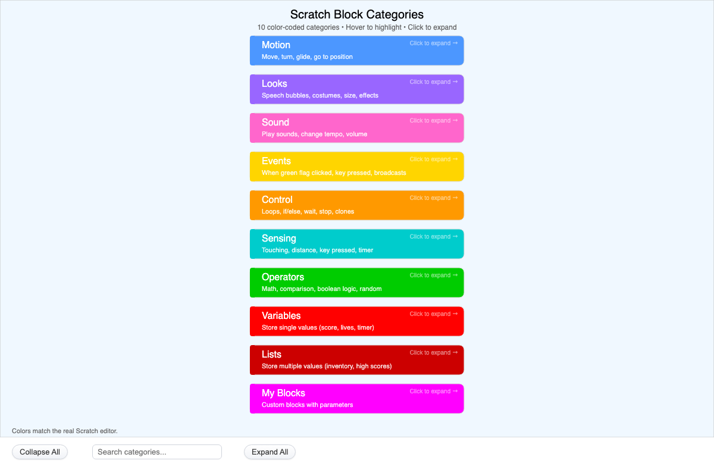

    Interactive infographic of Scratch's 10 color-coded block categories. Click a card to expand its example blocks, or use Expand All / Collapse All to explore every category at once.

-   **[Block Shape Flow](./block-shape-flow/index.md)**

    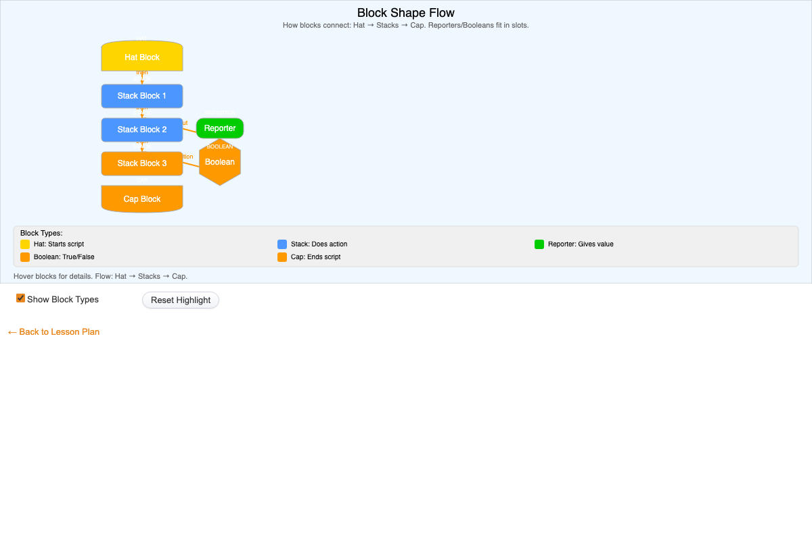

    Interactive diagram showing how Scratch block shapes connect in a script: a hat block starts it, stack blocks act in sequence, and reporter/boolean blocks plug into slots. Hover to highlight blocks.

-   **[Block Shapes](./block-shapes/index.md)**

    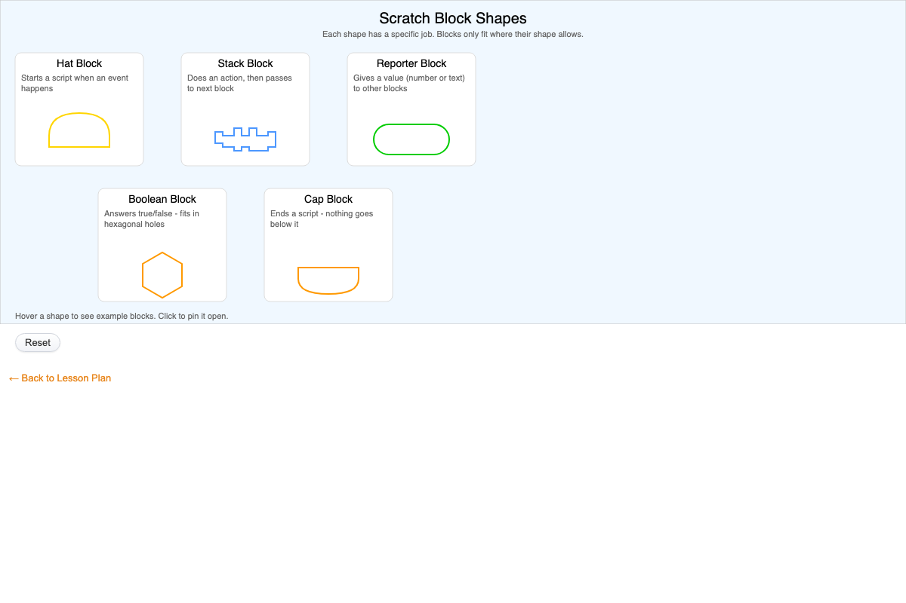

    Interactive gallery of Scratch's five block shapes (hat, stack, reporter, boolean, cap). Hover a card to see example blocks for that shape, or click to pin it open.

-   **[Broadcast Flow](./broadcast-flow/index.md)**

    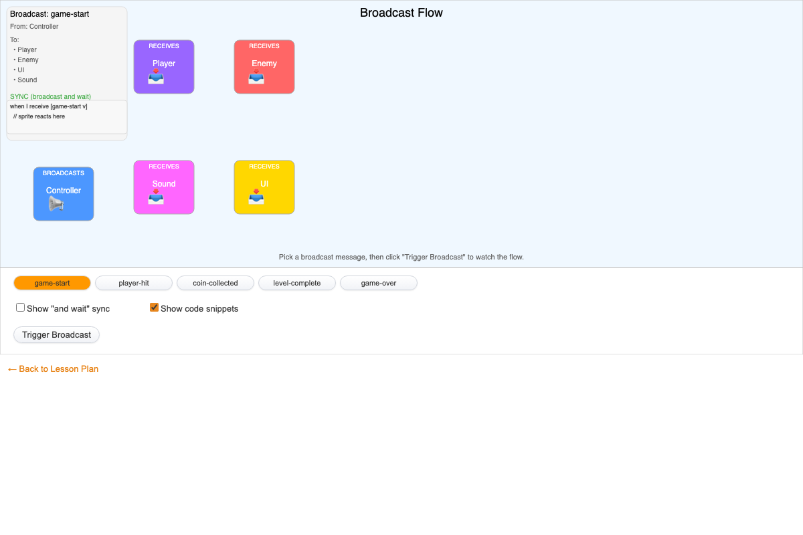

    Interactive diagram of Scratch's broadcast system. Pick a message and click Trigger Broadcast to animate it flowing from a sender sprite to its receivers, with sync mode and code snippets.

-   **[Coordinate Reporters in Action](./coordinate-reporters/index.md)**

    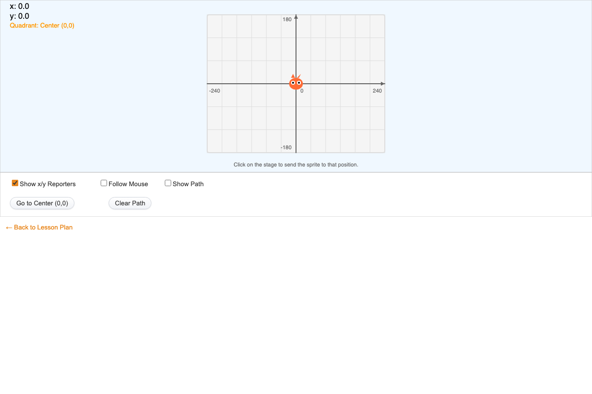

    Interactive p5.js MicroSim showing Scratch's x position and y position reporters: click the stage to move a sprite and watch live x/y readouts, an optional motion path, and mouse-follow mode.

-   **[Interactive Coordinate Explorer](./coordinate-explorer/index.md)**

    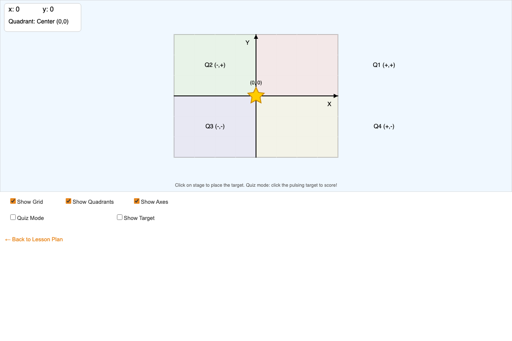

    Interactive p5.js coordinate plane: move the mouse or click the stage to place a star sprite and see its (x, y) coordinates and quadrant update live, plus a quiz mode that scores target clicks.

-   **[Learning Graph Viewer](./graph-viewer/index.md)**

    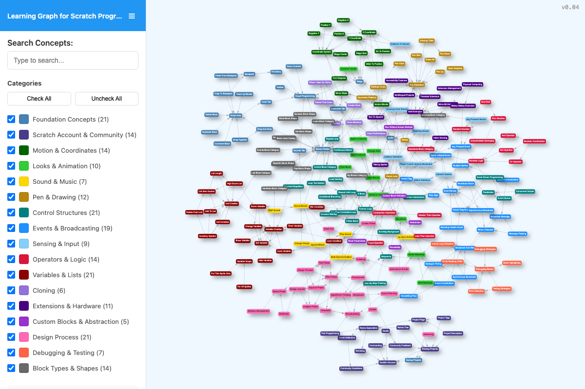

    Interactive learning graph viewer that lets users explore all concepts in the course and how they are related. Used by AI to recommend personalized learning paths.

-   **[Loop Comparison](./loop-comparison/index.md)**

    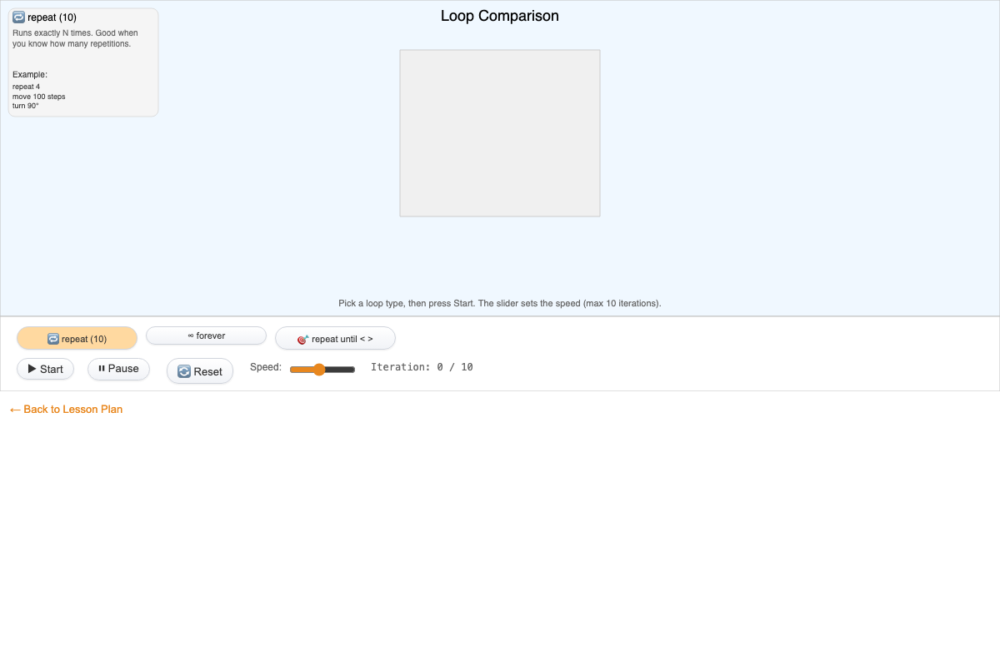

    Animated comparison of Scratch's repeat, forever, and repeat until loops, controlled with loop-select buttons, Start/Pause/Reset, and a speed slider.

-   **[Motion Blocks Visual Guide](./motion-blocks-guide/index.md)**

    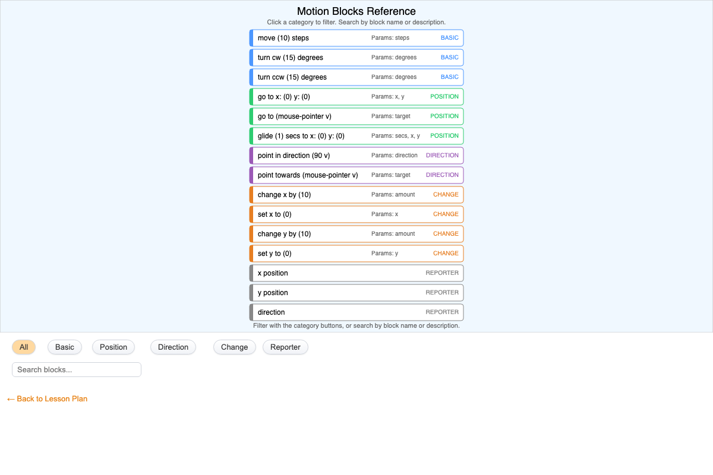

    Browsable reference of 15 Scratch Motion blocks, filterable by category (Basic, Position, Direction, Change, Reporter) and searchable by name or description.

-   **[Scratch Editor Overview](./editor-overview/index.md)**

    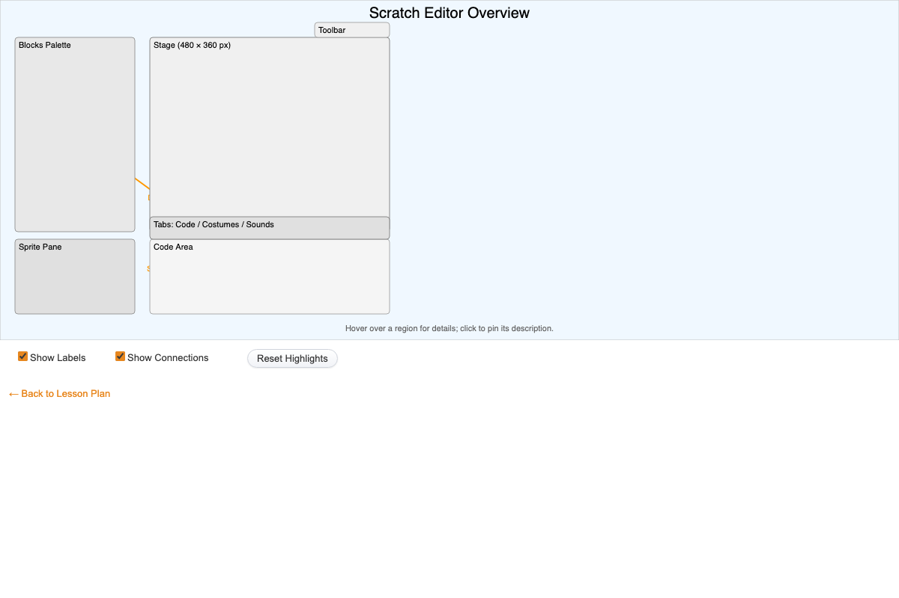

    Interactive p5.js diagram of the Scratch editor layout: hover or click regions like the Stage, Blocks Palette, Code Area, Sprite Pane, and Tabs to see descriptions and workflow connections.

-   **[Script Anatomy](./script-anatomy/index.md)**

    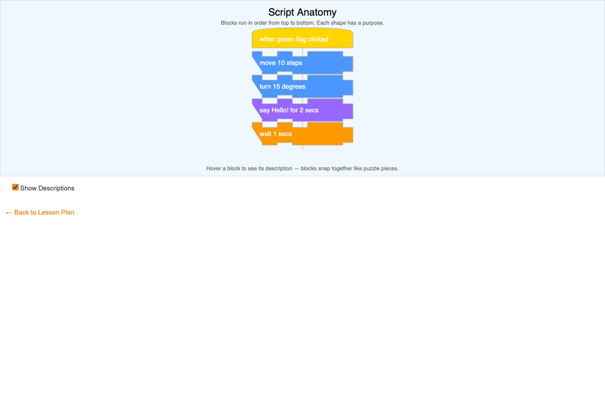

    Interactive diagram of a five-block Scratch script showing how hat and stack blocks snap together; hover any block to reveal its description via a toggleable checkbox.

-   **[Stage Coordinate System](./stage-coordinates/index.md)**

    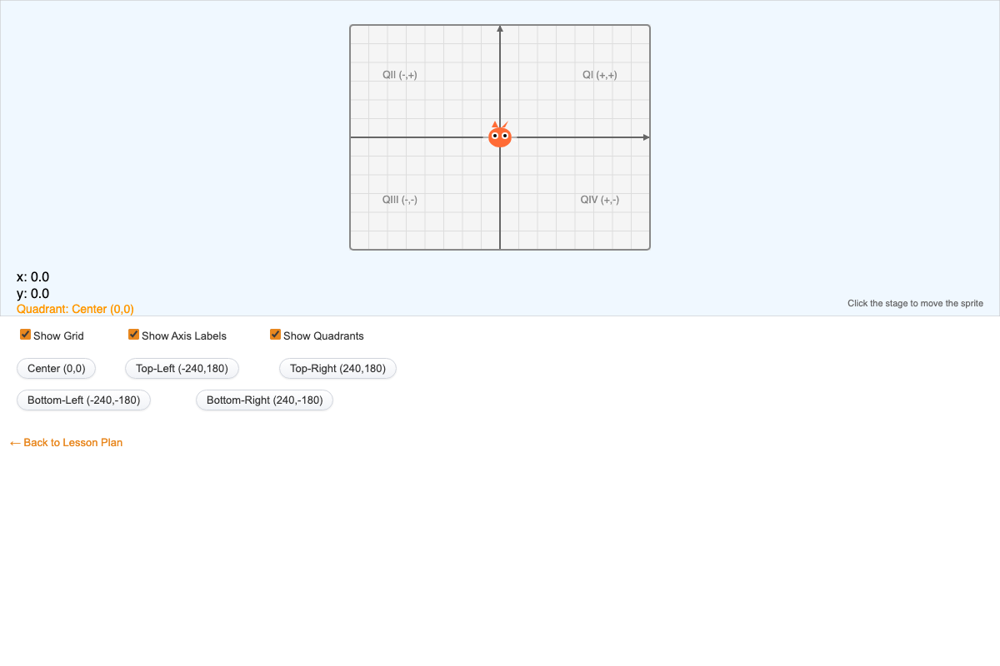

    Click anywhere on the Scratch stage to move a sprite and see its live x, y coordinates and quadrant; buttons jump to the center or corners, and checkboxes toggle the grid, labels, and quadrants.

-   **[Stage Layout and Boundaries](./stage-layout/index.md)**

    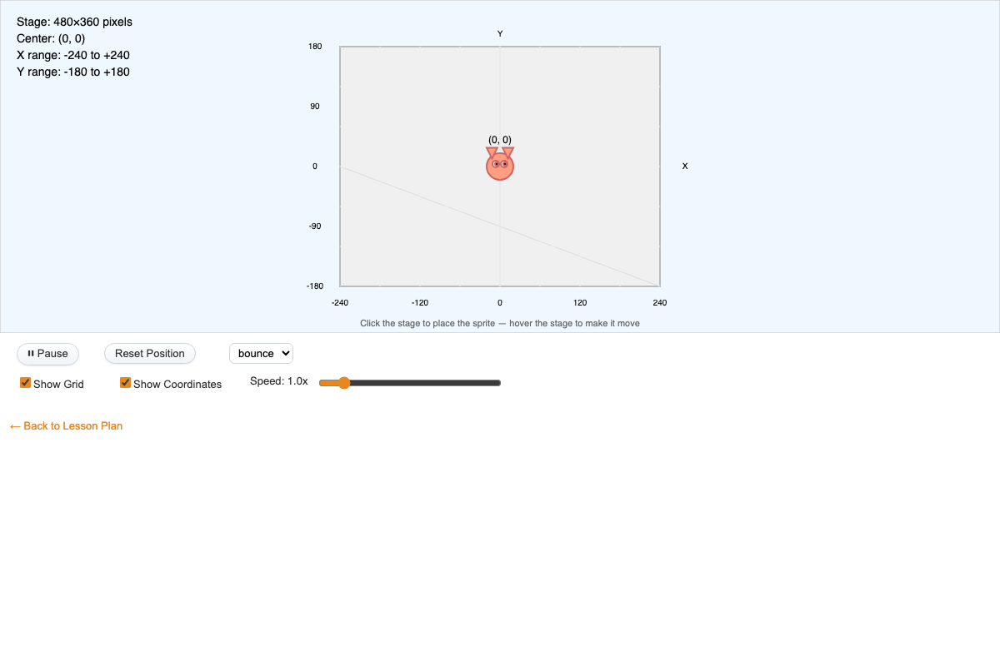

    A sprite moves on the 480x360 Scratch stage and bounces, stops, or wraps at the edges based on a dropdown choice, with pause, reset, click-to-place, a speed slider, and grid and coordinate toggles.

-   **[Three Tabs Explained](./three-tabs/index.md)**

    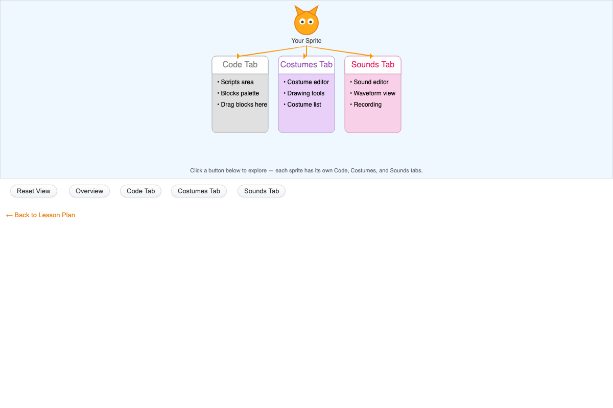

    Shows how a Scratch sprite owns its Code, Costumes, and Sounds tabs; buttons switch between an overview of all three and a detailed view of each tab, describing its purpose and key features.

